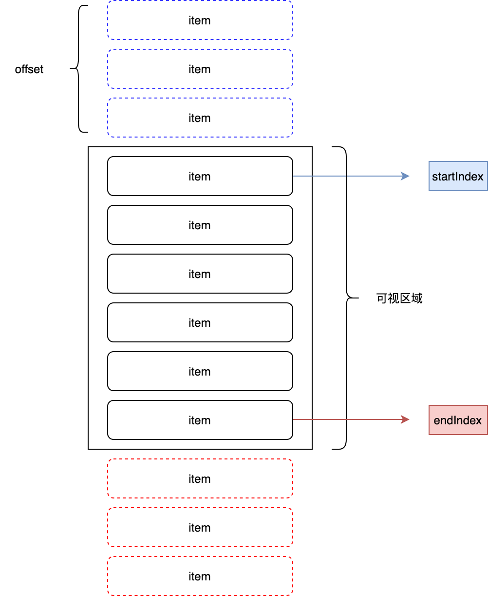

当列表数据量很大时，一次性渲染会花费很长时间，使用虚拟列表加快列表渲染速度。大概思路就是只渲染可视区域内的列表，当发生滚动时，重新计算可视区域内的列表。



已知信息：

1. 容器高度 containerHeight
2. 列表项高度 itemHeight
3. 滚动距离 scrollTop
4. 列表总高度 listHeight = itemHeight * list.length
5. 可视区域展示数量 displayCount = containerHeight / itemHeight

具体思路：

1. 监听 container 滚动事件得到 scrollTop
2. 计算 startIndex，startIndex = Math.floor(scrollTop / itemHeight)
3. 计算endIndex，endIndex = startIndex +  displayCount
4. 渲染 startIndex 至 endIndex, listData = list.slice(startIndex, endIndex)
5. 计算当前偏移量 offset，使 list 垂直方向偏移 offset，offset = scrollTop - (scrollTop % itemHeight)

具体实现：

```
import React, { useEffect, useMemo, useState } from 'react';
import styles from './index.less';

type Props = {
  itemHeight: number;
  containerHeight: number;
  itemRender: (data: any) => React.ReactNode;
  list: any[];
};

function VirtualList(props: Props) {
  const { itemHeight, containerHeight, itemRender, list } = props;
  // 计算列表高度
  const listHight = useMemo(() => list.length * itemHeight, [list.length, itemHeight]);
  // 计算可视数量
  const visibleCount = useMemo(() => Math.ceil(containerHeight / itemHeight), [containerHeight, itemHeight]);
  // 初始化展示数量
  const [listData, setListData] = useState<any[]>([]);
  // 初始偏移量
  const [offset, setOffset] = useState(0);

  const handleScroll = (e: any) => {
    const scrollTop = e.target.scrollTop;
    const startIndex = Math.floor(scrollTop / itemHeight);
    const endIndex = startIndex + visibleCount;
    const listData = list.slice(startIndex, endIndex);
    const offset = scrollTop - (scrollTop % itemHeight);
    setOffset(offset);
    setListData(listData);
  };

  useEffect(() => {
    setListData(list.slice(0, visibleCount));
  }, [list]);

  return (
    <div className={styles.container} style={{ height: containerHeight }} onScroll={handleScroll}>
      <div className={styles.phantom} style={{ height: listHight }}></div>
      <div className={styles.list} style={{ transform: `translateY(${offset}px)` }}>
        {listData && listData.length > 0 && listData.map((item: any) => itemRender(item))}
      </div>
    </div>
  );
}
export default VirtualList;
```